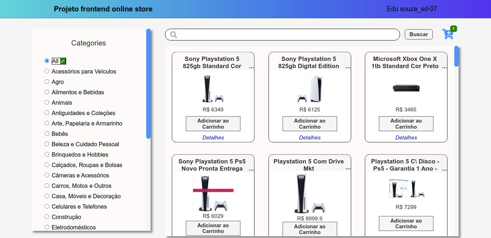

<h1 align="center">
  
</h1>

<h3 align="center">
  Curso realizado na Trybe - Edu Souza o/
</h3>

<blockquote align="center">“Sozinho mas não solitário, quem tem fé nunca está sozinho - Thomas Carlyle”</blockquote>

<h4 align="center">
  Repositório - Frontend online store 
</h4>

 

  &nbsp;
  &nbsp;
  

  <a href="#rocket-Sobre-o-projeto">Sobre o projeto</a>&nbsp; &nbsp; |&nbsp; &nbsp;
  <a href="#postbox-Entrega"">Entrega</a>&nbsp; &nbsp; |&nbsp; &nbsp;
  <a href="#unlock-Licença">Licença</a>

## :rocket: Sobre o projeto

#### Frontend online store 

O trabalho consiste em construir o Front-End de um e-commerce, uma loja online, alimentada por uma API do Mercado Livre.

#### Screenshots:

   &nbsp;

## :postbox: Entrega

#### :clipboard: Requisitos

- 
<a href="#1"> :pushpin: 1.</a> IMPLEMENTAR MÓDULO DE ACESSO À API DO MERCADO LIVRE.

- 
<a href="#2"> :pushpin: 2.</a> CRIAR PÁGINA DE LISTAGEM DE PRODUTOS VAZIA.

- 
<a href="#3"> :pushpin: 3.</a> CRIAR PÁGINA DO CARRINHO DE COMPRAS.

- 
<a href="#4"> :pushpin: 4.</a> LISTAR AS CATEGORIAS DE PRODUTOS DISPONÍVEIS VIA API NA PÁGINA PRINCIPAL.

- 
<a href="#5"> :pushpin: 5.</a> BUSCAR POR TERMOS E RECEBER UMA LISTAGEM DE PRODUTOS, COM DADOS RESUMIDOS, ASSOCIADOS A ESSES TERMOS.

- 
<a href="#6"> :pushpin: 6.</a> SELECIONAR UMA CATEGORIA E VER SOMENTE PRODUTOS DAQUELA CATEGORIA.

- 
<a href="#7"> :pushpin: 7.</a> CLICAR NA EXIBIÇÃO RESUMIDA DE UM PRODUTO E IR PARA UMA TELA COM SUA EXIBIÇÃO DETALHADA.

- 
<a href="#8"> :pushpin: 8.</a> ADICIONAR PRODUTOS A PARTIR DA TELA DE LISTAGEM DE PRODUTOS.

- 
<a href="#9"> :pushpin: 9.</a> ADICIONAR UM PRODUTO AO CARRINHO A PARTIR DE SUA TELA DE EXIBIÇÃO DETALHADA.

- 
<a href="#10"> :pushpin: 10.</a> VISUALIZAR A LISTA DE PRODUTOS ADICIONADOS AO CARRINHO EM SUA PÁGINA E MANIPULAR SUA QUANTIDADE.

- 
<a href="#11"> :pushpin: 11.</a> AVALIAR E COMENTAR ACERCA DE UM PRODUTO EM SUA TELA DE EXIBIÇÃO DETALHADA.

- 
<a href="#12"> :pushpin: 12.</a> FINALIZAR COMPRA, VENDO UM RESUMO DELA, PREENCHENDO OS MEUS DADOS E ESCOLHENDO A FORMA DE PAGAMENTO.

- 
<a href="#13"> :pushpin: 13.</a> VER JUNTO AO ÍCONE DO CARRINHO A QUANTIDADE DE PRODUTOS DENTRO DELE, EM TODAS AS TELAS EM QUE ELE APARECE.

- 
<a href="#14"> :pushpin: 14.</a> A QUANTIDADE DE PRODUTOS ADICIONADOS AO CARRINHO DEVE SER LIMITADA PELA QUANTIDADE DISPONÍVEL EM ESTOQUE.

- 
<a href="#15"> :pushpin: 15.</a> VER QUAIS PRODUTOS TEM FRETE GRÁTIS.

- 
<a href="#16"> :pushpin: 16.</a> FAÇA UM LAYOUT PARA O SITE.

  
### Concluído :rocket:

Acesse o deploy do projeto [aqui](https://edusouza-programmer.github.io/Trybe_Projeto_14-2_Edu_Souza/).

#
## :unlock: Licença

Este projeto está licenciado sob a Licença MIT - consulte [LICENSE](https://opensource.org/licenses/MIT) para maiores detalhes.
